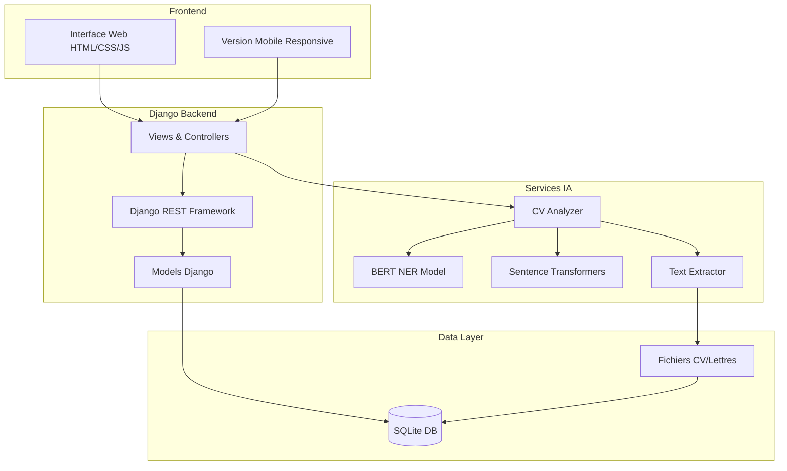
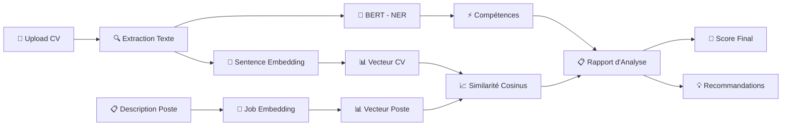
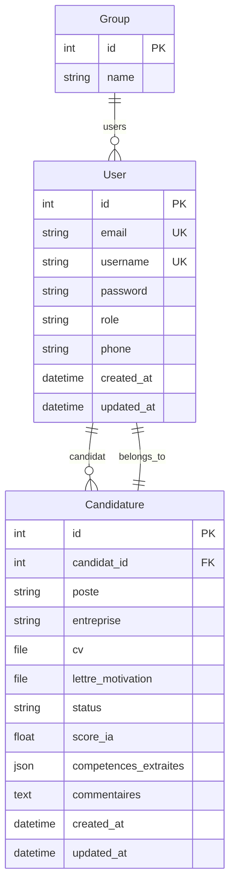
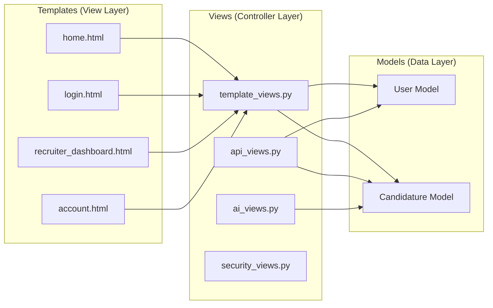
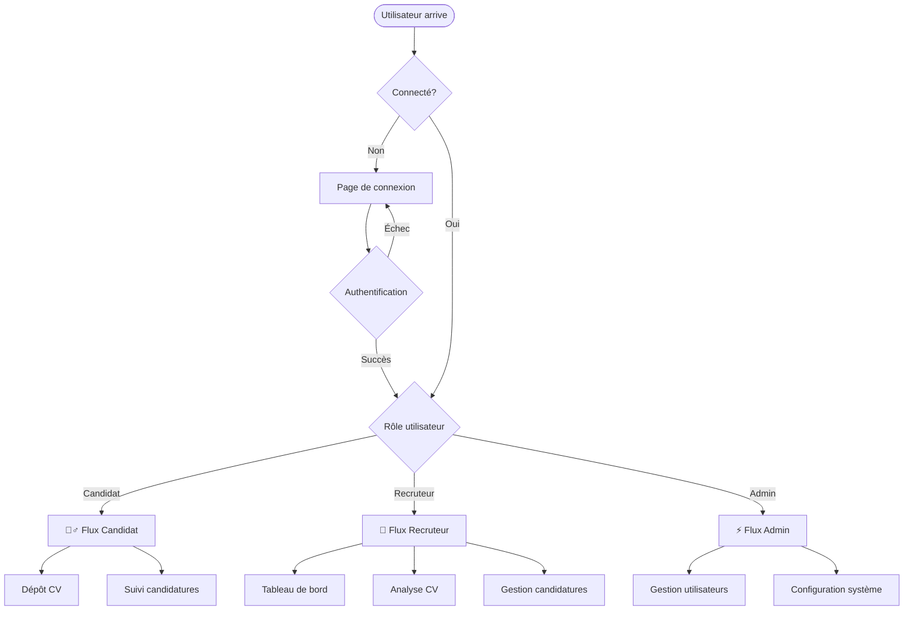
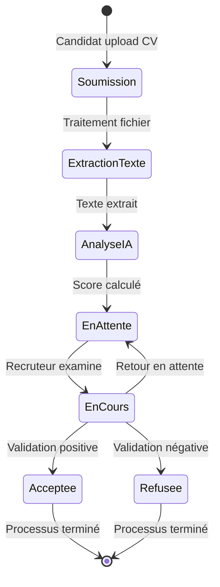
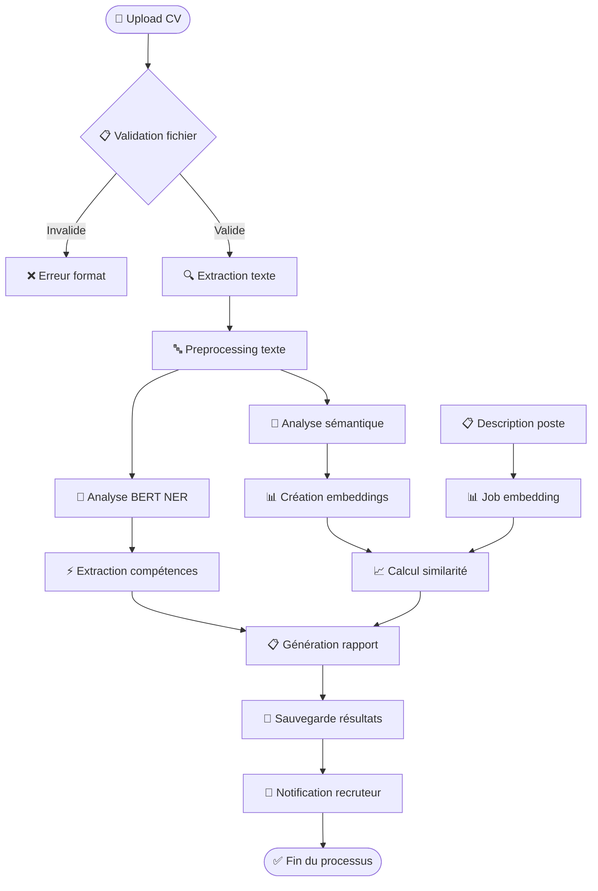
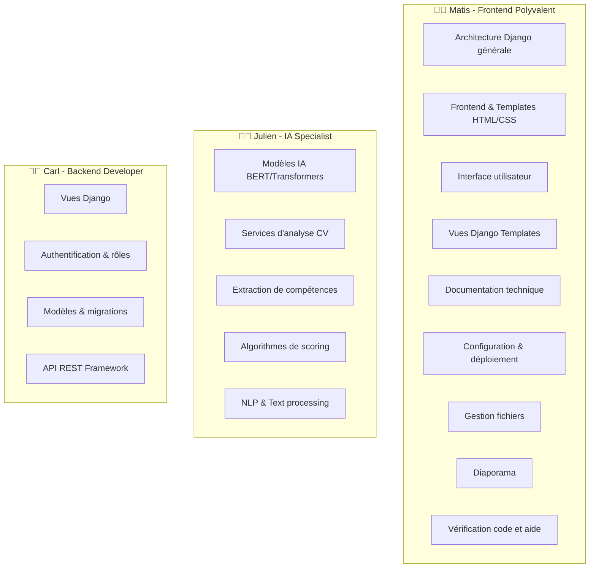

<div align="center">
    
# Analyse CV IA

Système d'analyse intelligente de CV avec modèles BERT et Transformers pour l'automatisation du processus de recrutement.

</div>

---

## 📋 Sommaire

1. [Présentation du projet](#-présentation-du-projet)
2. [Screenshots](#-screenshots)
3. [Installation et lancement](#-installation-et-lancement)
4. [Architecture technique](#-architecture-technique)
5. [Modèles de données](#-modèles-de-données)
6. [Vues et contrôleurs](#-vues-et-contrôleurs)
7. [Templates et interface](#-templates-et-interface)
8. [Services d'IA](#-services-dia)
9. [Flux de données](#-flux-de-données)
10. [Répartition des tâches](#-répartition-des-tâches)

---

## 🎯 Présentation du projet

**Analyse CV IA** est une plateforme web développée avec Django qui automatise le processus d'analyse de CV grâce à l'intelligence artificielle. Le système utilise des modèles de deep learning avancés (BERT, Transformers) pour :

- 📄 **Extraire automatiquement** les compétences et expériences des CV
- 🧠 **Analyser sémantiquement** le contenu avec des modèles IA
- 📊 **Calculer un score de correspondance** entre CV et offre d'emploi
- 🔍 **Classer automatiquement** les candidatures
- 📱 **Fournir une interface web** intuitive pour recruteurs et candidats
- 🚀 **Exposer une API REST** pour intégrations tierces

### 🎯 Objectifs pédagogiques
Ce projet a été développé dans le cadre d'un cours d'analyse de CV par IA, permettant d'explorer :
- L'intégration de modèles de NLP dans une application web
- L'architecture Django pour applications IA
- Les bonnes pratiques en développement collaboratif

---

##  Screenshots

### Page d'accueil - Dépôt de CV


*Interface de dépôt de CV avec drag & drop*

### Inscription Candidat


*Formulaire d'inscription pour les candidats*

### Dashboard Recruteur


*Tableau de bord avec liste des candidatures et scores IA*

### Analyse détaillée


*Résultats détaillés de l'analyse IA d'un CV*

---

## 🚀 Installation et lancement

### Prérequis
- Python 3.8+
- pip (gestionnaire de paquets Python)
- Git

### Installation rapide

1. **Cloner le projet**
```bash
git clone https://github.com/MatisAgr/Analyse-CV-AI.git
cd Analyse-CV-AI
```

2. **Créer et activer l'environnement virtuel**
```bash
python -m venv .venv
.venv\Scripts\activate  # Windows
# ou
source .venv/bin/activate  # Linux/Mac
```

3. **Installer les dépendances**
```bash
pip install -r requirements.txt
```

4. **Configuration de la base de données**
```bash
cd CVAnalyzerProject
python manage.py migrate
```

5. **Créer des données de test (optionnel)**
```bash
python manage.py init_groups
python manage.py create_test_users
python manage.py init_test_data
```

6. **Lancer le serveur**
```bash
python manage.py runserver
```

📱 **Interface web** : http://127.0.0.1:8000/

### Comptes de test
- **Admin** : admin@example.com / admin123
- **Recruteur** : recruteur@example.com / recrut123
- **Candidat** : candidat@example.com / candidat123

---

## 🏗️ Architecture technique

### Architecture générale du système



### Stack technologique

| Composant | Technologies |
|-----------|-------------|
| **Backend** | Django 5.2.5, Django REST Framework |
| **IA/ML** | PyTorch, Transformers (Hugging Face), BERT |
| **NLP** | NLTK, Sentence Transformers |
| **Base de données** | SQLite (dev), PostgreSQL (prod pour le futur) |
| **Frontend** | HTML5, CSS3, JavaScript, Tailwind CSS |
| **Traitement fichiers** | PyPDF2, python-docx |

### Flux d'analyse IA



### Modèles d'IA utilisés

1. **BERT** : `bert-large-cased-finetuned-conll03-english`
   - Extraction d'entités nommées (NER)
   - Reconnaissance de compétences techniques

2. **Sentence Transformers** : `all-MiniLM-L6-v2`
   - Encodage sémantique des textes
   - Calcul de similarité CV/poste

---

## 📊 Modèles de données

### Diagramme relationnel



### User (Utilisateur personnalisé)
```python
class User(AbstractUser):
    ROLE_CHOICES = [
        ('admin', 'Administrateur'),
        ('recruteur', 'Recruteur'),
        ('candidat', 'Candidat'),
    ]
    username = models.CharField(max_length=150, unique=True)
    email = models.EmailField(unique=True)  # Identifiant de connexion
    role = models.CharField(max_length=20, choices=ROLE_CHOICES)
    phone = models.CharField(max_length=15, blank=True)  # Non utilisé
    created_at = models.DateTimeField(auto_now_add=True)
    # first_name et last_name sont hérités de AbstractUser
```

### Candidature
```python
class Candidature(models.Model):
    STATUS_CHOICES = [
        ('en_attente', 'En attente'),
        ('en_cours', 'En cours d\'examen'),
        ('acceptee', 'Acceptée'),
        ('refusee', 'Refusée'),
    ]
    
    candidat = models.ForeignKey(User, on_delete=models.CASCADE)
    poste = models.CharField(max_length=200)
    entreprise = models.CharField(max_length=200)
    cv = models.FileField(upload_to=upload_cv_to)
    lettre_motivation = models.FileField(upload_to=upload_lettre_to, blank=True)
    status = models.CharField(max_length=20, choices=STATUS_CHOICES)
    score_ia = models.FloatField(null=True, blank=True)
    competences_extraites = models.JSONField(default=list)
    commentaires = models.TextField(blank=True)
```

---

## 🎛️ Vues et contrôleurs

### Architecture MVC Django



### Structure des vues
```
views/
├── template_views.py    # Vues pour templates HTML
├── api_views.py        # API REST endpoints
├── ai_views.py         # Fonctionnalités IA
└── security_views.py   # Sécurité et permissions
```

### Flux utilisateur par rôle



### Principales vues

#### Templates Views (`template_views.py`)
- **home()** : Page d'accueil avec dépôt de CV
- **login_view()** : Authentification utilisateurs
- **register_view()** : Inscription nouveaux utilisateurs
- **account_view()** : Tableau de bord personnel
- **recruiter_dashboard()** : Interface recruteur

#### API Views (`api_views.py`)
- **CandidatureListCreateAPIView** : CRUD candidatures via API
- **CandidatureDetailAPIView** : Détail d'une candidature
- **UserProfileAPIView** : Gestion profils utilisateurs

#### AI Views (`ai_views.py`)
- **analyze_cv_view()** : Point d'entrée analyse IA
- **upload_and_analyze_cv()** : Upload + analyse automatique
- **get_analysis_results()** : Récupération résultats d'analyse

---

## 🎨 Templates et interface

### Structure des templates
```
templates/
├── core/
│   ├── base.html                 # Template de base avec balisage commun et body dynamique
├── components/
│   ├── navbar.html               # Navigation principale
│   └── footer.html               # Pied de page
└── pages/
    ├── home.html                 # Page d'accueil
    ├── login.html                # Connexion
    ├── register.html             # Inscription
    ├── account.html              # Compte utilisateur
    ├── recruiter_dashboard.html  # Tableau de bord recruteur
    └── candidature_detail.html   # Détail candidature
```

### Fonctionnalités interface

- **Design responsive** : Compatible mobile/desktop
- **Navigation intuitive** : Différentielle selon le rôle
- **Upload drag & drop** : Interface moderne pour multi-fichiers
- **Notifications temps réel** : Système de messages Django
- **Tableaux interactifs** : Tri, filtrage, pagination *(pas encore implémenté)*
- **Visualisations** : Score, moyennes et nombre de candidatures

---

## 🤖 Services d'IA

### TextExtractor (`text_extractor.py`)
```python
class TextExtractor:
    """Extraction de texte depuis PDF/DOC/DOCX"""
    
    def extract_from_pdf(self, file_path: str) -> str
    def extract_from_docx(self, file_path: str) -> str
    def extract_from_doc(self, file_path: str) -> str
```

### CVAnalyzer (`cv_analyzer.py`)
```python
class CVAnalyzer:
    """Analyseur IA principal utilisant BERT et Sentence Transformers"""
    
    def __init__(self):
        self.ner_pipeline = pipeline("ner", model="bert-large-cased-finetuned-conll03-english")
        self.sentence_model = SentenceTransformer('all-MiniLM-L6-v2')
    
    def analyze_cv(self, cv_text: str, job_description: str) -> dict
    def extract_skills(self, text: str) -> List[str]
    def calculate_match_score(self, cv_text: str, job_text: str) -> float
```

### Fonctionnalités IA

1. **Extraction d'entités** : Noms, organisations, lieux, compétences
2. **Analyse sémantique** : Compréhension du contexte et du sens
3. **Score de correspondance** : Calcul de similarité cosinus
4. **Classification automatique** : Catégorisation des candidatures
5. **Extraction de compétences** : Identification automatique des skills

---

## Flux de données

### Cycle de vie d'une candidature



### Pipeline d'analyse IA complète



## 👥 Répartition des tâches

### Organisation de l'équipe




### Détail des contributions

### 👩‍💻 **Matis** (Frontend & Polyvalent)
- **Architecture et structure générale** du projet Django
- **Design et intégration** des templates HTML/CSS (`home.html`, `login.html`, etc.)
- **Développement des vues Django** (`template_views.py`, `ai_views.py`)
- **Développement de l'interface utilisateur** et navigation
- **Intégration JavaScript** pour interactions dynamiques
- **UX/UI** et ergonomie utilisateur
- **Documentation technique** complète et README
- **Configuration projet** et déploiement
- **Gestion avancée des fichiers** (upload, validation, stockage sécurisé)
- **Polyvalence** : Support sur backend et IA selon les besoins
- **Revues de code** systématiques et ajustements
- **Documentation utilisateur** et guides d'installation


### 👩‍💻 **Julien** (IA)
- **Intégration des modèles IA** (BERT, Transformers, Sentence Transformers)
- **Développement des services d'analyse** (`cv_analyzer.py`, `text_extractor.py`)
- **Algorithmes d'extraction** de compétences et entités nommées
- **Calcul de scores** de correspondance CV/poste avec similarité cosinus
- **Preprocessing NLP** et optimisation des pipelines
- **Analyse des performances** des modèles

### 👩‍💻 **Carl** (Backend)  
- **Développement des vues Django** (`api_views.py`, `security_views.py`)
- **Système d'authentification** complet et gestion des rôles/permissions
- **Conception des modèles** de données (User, Candidature) et migrations
- **API REST** complète avec Django REST Framework
- **Sécurité** : Permissions, validation des données, protection CSRF
- **Optimisation base de données** et requêtes

---

## 📚 Ressources et références

- [Documentation Django](https://docs.djangoproject.com/)
- [Django REST Framework](https://www.django-rest-framework.org/)
- [Hugging Face Transformers](https://huggingface.co/docs/transformers/)
- [Sentence Transformers](https://www.sbert.net/)
- [BERT Paper](https://arxiv.org/abs/1810.04805)


---

**Développé avec ❤️😵‍💫😡🤯🫠 par le groupe 4**
